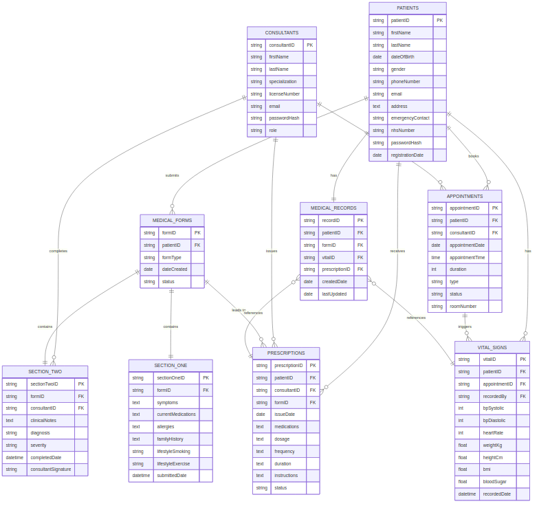

# List of Figures

| Figure | Description |
|:-------|:------------|
| Figure 1 | BPMN Diagram - [Process Name] |
| Figure 2 | BPMN Diagram - [Process Name] |
| Figure 3 | BPMN Diagram - [Process Name] |
| Figure 4 | UML Class Diagram |
| Figure 5 | Entity Relationship Diagram (ERD) |
| Figure 6 | Enterprise Cloud Architecture |
| Figure 7 | Prototype Screenshot - [Screen Name] |
| Figure 8 | Prototype Screenshot - [Screen Name] |
| Figure 9 | ScrumDesk Dashboard |
| Figure 10 | Sprint Burndown Chart |

\newpage

# List of Tables

| Table | Description |
|:------|:------------|
| Table 1 | Business Processes |
| Table 2 | Scope Definition |
| Table 3 | System Components |
| Table 4 | Security Considerations |
| Table 5 | Technology Stack |
| Table 6 | Sprint Planning |
| Table 7 | User Stories |
| Table 8 | Cloud Provider Comparison |
| Table 9 | Test Results |
| Table 10 | Challenges and Solutions |

\newpage

# Introduction {#sec-introduction}

*[5 Marks]*

## Organisation Overview

[Provide a brief overview of the organisation/case study selected. Include: organisation name, location, size, industry sector, and primary business activities. Approximately 200-300 words.]

**Example for Case Study 4 (CVD Clinic):**

The CVD Clinic is a cardiovascular specialist clinic located in West London, United Kingdom. The clinic specialises in the diagnosis and treatment of cardiovascular diseases, including hypertension, hypotension, and diabetes-related cardiac conditions. The facility employs approximately 15 staff members, including 3 cardiovascular specialists/consultants, 4 nurses, and administrative personnel.

The clinic currently operates using a paper-based patient record system, which has become increasingly problematic as patient numbers have grown. The existing manual processes are causing delays in patient consultations, increasing the risk of data entry errors, and making it difficult to track patient medical history over time.

## Problem Statement

[Describe the current problems or pain points that the organisation faces. What challenges necessitate a digital transformation? Approximately 200 words.]

Key problems identified:

- Manual form filling causes errors and delays
- No digital record of patient history
- Prescription generation is manual and time-consuming
- Difficulty in tracking patient vital signs over time
- Limited accessibility for patients

## Business Processes

[List and briefly describe the key business processes identified:]

::: {#tbl-processes}
| Process Name | Description |
|:-------------|:------------|
| Patient Registration | New patients provide personal and medical history |
| Pre-Examination Forms | Patients complete Section 1 before seeing doctor |
| Vital Signs Recording | BMI, Blood Pressure, blood sugar checks |
| Specialist Consultation | Consultant reviews forms and conducts examination |
| Prescription Generation | Consultant issues prescriptions based on diagnosis |
| Appointment Booking | Scheduling follow-up visits |

Business Processes Summary
:::

## Proposed Solution

[Outline the proposed cloud-based solution. What will the system do? Who are the users? What are the main features? Approximately 200-300 words.]

The proposed solution is a cloud-based patient record management system that will:

- Provide a web portal for patients to pre-fill forms
- Enable digital completion of consultations by staff
- Automate prescription generation
- Store patient records securely in the cloud
- Allow appointment booking and management

## Scope of Work

[Define what is included and excluded from the project scope.]

::: {#tbl-scope}
| In Scope | Out of Scope |
|:---------|:-------------|
| Patient portal for form completion | Mobile app development |
| Staff portal for consultations | Integration with external NHS systems |
| Prescription generation | Payment processing |
| Appointment scheduling | Video consultation features |

Project Scope Definition
:::

\newpage

# Business Process Model (BPMN) {#sec-bpmn}

*[10 Marks]*

[This section presents the Business Process Model and Notation (BPMN) diagrams created using **Bonita Software**. These diagrams illustrate the business processes identified in @sec-introduction.]

## Process 1: [Process Name]

[Brief description of this process and its importance.]

<!-- {#fig-bpmn1 width=90%} -->

**Process explanation:** [Describe the swimlanes, tasks, gateways, and flow. Explain how the process works step-by-step. Approximately 200 words.]

**Lane: Patient**

- Start Event: "Arrive at Clinic"
- Task: "Login to Portal/Register"
- Task: "Fill Section 1 Form"
- Gateway: "Form Complete?"
- Task: "Submit Form"
- Task: "Receive Prescription"
- End Event

**Lane: Nurse/Admin Staff**

- Start Event: "Patient Arrives"
- Task: "Verify Patient Identity"
- Task: "Check Vitals" (BMI, BP, Blood Sugar)
- Task: "Record Vital Signs in System"
- End Event

**Lane: Consultant**

- Start Event: "Patient Ready"
- Task: "Review Section 1"
- Task: "Conduct Examination"
- Task: "Complete Section 2"
- Gateway: "Diagnosis Required?"
- Task: "Generate Prescription"
- End Event

## Process 2: [Process Name]

[Brief description of this process.]

<!-- {#fig-bpmn2 width=90%} -->

**Process explanation** [Approximately 200 words.]

## Process 3: [Process Name]

[Brief description of this process.]

<!-- {#fig-bpmn3 width=90%} -->

**Process explanation** [Approximately 200 words.]

\newpage

# Class Diagram & Entity Relationship Diagram {#sec-uml}

*[10 Marks]*

## UML Class Diagram

[This section presents the Unified Modeling Language (UML) Class Diagram created using **StarUML**. The diagram shows the system's static structure, including classes, attributes, operations, and relationships.]

{#fig-class width=90%}

### Class Descriptions

[List each class with its attributes and operations:]

::: {#tbl-classes}
| Class Name | Attributes | Operations |
|:-----------|:-----------|:-----------|
| Patient | patientID, firstName, lastName, dateOfBirth, email, phone | register(), updateProfile(), viewHistory() |
| MedicalForm | formID, patientID, formType, dateCreated, status | submitForm(), editForm(), validateForm() |
| SectionOne | symptoms, medications, allergies, familyHistory | autoFillFromHistory(), validateRequiredFields() |
| SectionTwo | clinicalNotes, diagnosis, severity, consultantID | addClinicalNotes(), setDiagnosis() |
| Consultant | consultantID, name, specialization, licenseNumber | examinePatient(), completeSectionTwo(), generatePrescription() |
| VitalSigns | vitalID, patientID, bpSystolic, bpDiastolic, bmi, weight, height | calculateBMI(), flagAbnormalValues() |
| Prescription | prescriptionID, patientID, medications, dosage, frequency | generatePrescription(), sendToPharmacy(), emailToPatient() |
| Appointment | appointmentID, patientID, date, type, status | scheduleAppointment(), reschedule(), cancel() |

Class Descriptions
:::

### Relationships

[Describe the relationships between classes: inheritance, association, aggregation, composition. Include cardinality (1:1, 1:N, M:N).]

- **Patient 1 --- * MedicalForm** (One patient has many forms over time)
- **Patient 1 --- * VitalSigns** (Multiple vital checks)
- **Patient 1 --- * Prescription** (Many prescriptions)
- **Patient 1 --- * Appointment** (Many appointments)
- **MedicalForm 1 --- 1 SectionOne** (Each form has exactly one Section 1)
- **MedicalForm 1 --- 1 SectionTwo** (Each form has exactly one Section 2)
- **Consultant 1 --- * MedicalForm** (Consultant completes many Section 2s)

## Entity Relationship Diagram (ERD)

[The ERD shows the database structure including entities, attributes, primary keys, foreign keys, and relationships.]

{#fig-erd width=90%}

### Database Schema

[Provide SQL CREATE TABLE statements for key entities:]

```sql
-- Patients Table
CREATE TABLE Patients (
    patientID VARCHAR(20) PRIMARY KEY,
    firstName VARCHAR(50),
    lastName VARCHAR(50),
    dateOfBirth DATE,
    gender VARCHAR(10),
    phone VARCHAR(20),
    email VARCHAR(100),
    address TEXT,
    nhsNumber VARCHAR(20) UNIQUE,
    password_hash VARCHAR(255),
    registrationDate DATE
);

-- Medical Forms Table
CREATE TABLE MedicalForms (
    formID VARCHAR(20) PRIMARY KEY,
    patientID VARCHAR(20),
    formType VARCHAR(50),
    status VARCHAR(20),
    createdDate TIMESTAMP,
    FOREIGN KEY (patientID) REFERENCES Patients(patientID)
);

-- Section One (Patient-filled)
CREATE TABLE SectionOne (
    sectionOneID VARCHAR(20) PRIMARY KEY,
    formID VARCHAR(20),
    symptoms TEXT,
    currentMedications TEXT,
    allergies TEXT,
    familyHistory TEXT,
    submittedDate TIMESTAMP,
    FOREIGN KEY (formID) REFERENCES MedicalForms(formID)
);

-- Section Two (Consultant-filled)
CREATE TABLE SectionTwo (
    sectionTwoID VARCHAR(20) PRIMARY KEY,
    formID VARCHAR(20),
    consultantID VARCHAR(20),
    clinicalNotes TEXT,
    diagnosis VARCHAR(200),
    severity VARCHAR(20),
    completedDate TIMESTAMP,
    FOREIGN KEY (formID) REFERENCES MedicalForms(formID),
    FOREIGN KEY (consultantID) REFERENCES Consultants(consultantID)
);
```

\newpage

# Enterprise Cloud Architecture {#sec-architecture}

*[10 Marks]*

## Architecture Overview

[Describe the overall cloud architecture approach. Which cloud provider (AWS/Azure)? What is the deployment model (IaaS, PaaS, SaaS)? Approximately 200 words.]

**Selected Cloud Provider:** [AWS / Microsoft Azure]

**Deployment Model:** [IaaS / PaaS / Hybrid]

The architecture follows a three-tier web application pattern with clear separation of concerns between presentation, application, and data layers. The system is deployed on [AWS/Azure] to leverage cloud benefits including scalability, high availability, and managed services.

## Architecture Diagram

[The diagram below shows the complete cloud architecture including: VPC/subnets, compute resources (EC2/VMs), database (RDS/Azure SQL), load balancers, security groups, etc.]

<!-- {#fig-architecture width=95%} -->

## Architecture Components

[Describe each layer/tier of the architecture:]

### Presentation Tier

[Web servers, load balancers, CDN. Detailed description of components and their purpose.]

- **Public Subnet 1:** Patient Portal (Web Server)
- **Public Subnet 2:** Staff Portal (Web Server)
- **Load Balancer:** Distributes traffic across web servers
- **Internet Gateway:** Allows public access to patient portal

### Application Tier

[Application servers, business logic. Detailed description.]

- **Private Subnet 1:** Application Server
- **Business Logic:** Form validation, workflows, authentication

### Data Tier

[Database, backup storage, caching. Detailed description.]

- **Private Subnet 2:** RDS (MySQL/PostgreSQL)
  - Patients Database
  - Forms Database
  - Audit Logs
- **Backup Storage:** S3/Blob storage for daily backups

### Security Layer

[Firewalls, IAM, encryption, VPN. Detailed description.]

- **VPN Gateway:** Secure connection from clinic to cloud
- **NAT Gateway:** Allows private subnets to reach internet
- **Bastion Host/Jump Box:** Secure admin access

## Justification

[Justify your architecture decisions: Why cloud? Why this provider? How does it meet scalability, security, and cost requirements? Approximately 300 words.]

**Why Cloud?**

1. **Scalability:** Handle peak appointment times automatically
2. **Accessibility:** Patients can access portal from home
3. **Cost:** Pay-as-you-go vs. expensive on-premise servers
4. **Disaster Recovery:** Automated backups and replication

**Provider Selection:**

[Justify why AWS or Azure was selected based on: pricing, available services, documentation, team expertise, etc.]

## Security Considerations

[Describe security measures implemented:]

::: {#tbl-security}
| Security Aspect | Implementation |
|:----------------|:---------------|
| Encryption at Rest | AWS KMS / Azure Key Vault |
| Encryption in Transit | SSL/TLS certificates |
| Access Control | IAM Roles / Azure AD |
| Network Security | Security Groups, NACLs, WAF |
| Backup & Recovery | Automated daily backups to S3/Blob |
| Data Residency | EU/UK data centers only |
| Audit Logging | CloudTrail / Azure Monitor |

Security Implementation
:::

**GDPR Compliance:**

- Patient data encryption
- Role-based access control (patients see only their data)
- Right to erasure procedures
- Data portability features
- Audit trails for all data access

\newpage

# Prototype Implementation {#sec-prototype}

*[30 Marks]*

## Technology Stack

[List and justify the technologies used:]

::: {#tbl-techstack}
| Layer | Technology | Justification |
|:------|:-----------|:--------------|
| Frontend | HTML5, CSS3, JavaScript / React | [Reason] |
| Backend | PHP / Node.js / Python | [Reason] |
| Database | MySQL / PostgreSQL | [Reason] |
| Cloud Platform | AWS / Azure | [Reason] |
| Web Server | Apache / Nginx | [Reason] |

Technology Stack
:::

## Database Implementation

[Describe how the database was implemented. Include connection details, ORM if used, key tables and relationships.]

The database was implemented using [MySQL/PostgreSQL] on [AWS RDS / Azure SQL Database]. Connection is established through [PDO / mysqli / Sequelize / etc.] with prepared statements to prevent SQL injection.

**Key Implementation Details:**

- Database connection pooling
- Prepared statements for security
- Indexing on frequently queried columns
- Foreign key constraints for referential integrity

## User Interface Screens

[Present screenshots of the prototype with descriptions:]

### Screen 1: [Screen Name]

[Description of this screen and its functionality.]

<!-- {#fig-screen1 width=80%} -->

**Features:**

- Feature 1 description
- Feature 2 description
- Feature 3 description

### Screen 2: [Screen Name]

[Description of this screen and its functionality.]

<!-- {#fig-screen2 width=80%} -->

### Screen 3: [Screen Name]

[Description of this screen and its functionality.]

<!-- {#fig-screen3 width=80%} -->

### Screen 4: [Screen Name]

[Description of this screen and its functionality.]

<!-- {#fig-screen4 width=80%} -->

## Key Features Implemented

[List the main features that were successfully implemented:]

1. **[Feature 1]:** [Description of feature and how it works]
2. **[Feature 2]:** [Description of feature and how it works]
3. **[Feature 3]:** [Description of feature and how it works]
4. **[Feature 4]:** [Description of feature and how it works]
5. **[Feature 5]:** [Description of feature and how it works]

## AI/ML Component (if applicable)

[Describe any AI/ML component included in the prototype. What does it do? How was it implemented? What data does it use? How accurate is it?]

**Example for Case Study 4:**

The system includes a cardiovascular risk prediction model that analyzes patient data (BMI, blood pressure, age, family history) to predict the likelihood of cardiovascular events.

**Implementation:**

- Algorithm: [Logistic Regression / Random Forest / Neural Network]
- Training Data: [Description of dataset]
- Features: BMI, systolic BP, diastolic BP, age, smoking status
- Accuracy: [X]% on test data
- Integration: Model deployed as REST API endpoint

\newpage

# Agile Management (ScrumDesk) {#sec-agile}

*[7 Marks]*

## Project Setup

[Describe the ScrumDesk project configuration: project name, team members, sprint duration, etc.]

**Project Name:** [e.g., "CVD Clinic Digital Transformation"]

**Team Configuration:**

- Scrum Master: [Name]
- Product Owner: [Name]
- Developers: [Names]
- QA/Tester: [Name]

**Sprint Duration:** 2 weeks

## Sprint Planning

[Describe how sprints were planned and executed:]

::: {#tbl-sprints}
| Sprint | Duration | Goals | Status |
|:-------|:---------|:------|:-------|
| Sprint 1 | Weeks 1-2 | Foundation: Database setup, authentication | Complete |
| Sprint 2 | Weeks 3-4 | Patient features: Forms, appointments | Complete |
| Sprint 3 | Weeks 5-6 | Staff features: Dashboard, consultations | Complete |
| Sprint 4 | Weeks 7-8 | Prescriptions, testing, documentation | Complete |

Sprint Planning
:::

## User Stories

[Examples of user stories created:]

::: {#tbl-userstories}
| User Story | Priority | Story Points |
|:-----------|:---------|:-------------|
| As a patient, I want to register an account so that I can access the portal | High | 5 |
| As a patient, I want to fill Section 1 online so that I don't wait at the clinic | High | 8 |
| As a nurse, I want to record vital signs so that consultants can review them | High | 5 |
| As a consultant, I want to complete Section 2 so that I can document diagnosis | High | 8 |
| As a patient, I want to book appointments online so that I can choose convenient times | Medium | 5 |
| As a consultant, I want to generate prescriptions so that patients receive medication | High | 8 |

User Stories
:::

## ScrumDesk Screenshots

[Include ScrumDesk dashboard and task board screenshots:]

<!-- {#fig-scrumdesk width=90%} -->

## Sprint Metrics

[Describe velocity, burndown charts, team performance:]

<!-- {#fig-burndown width=80%} -->

**Velocity Tracking:**

- Sprint 1: [X] story points
- Sprint 2: [X] story points
- Sprint 3: [X] story points
- Sprint 4: [X] story points

**Key Metrics:**

- Average Velocity: [X] story points per sprint
- Completion Rate: [X]%
- Technical Debt: [Description]

\newpage

# Individual Reflective Evaluation {#sec-reflection}

*[10 Marks]*

*[Word count: 500-800 words]*

## Personal Contribution

[Describe your specific contributions to the project. Which tasks did you complete? Which diagrams did you create? What code did you write? Be specific and detailed.]

**My Responsibilities:**

- [Specific task 1: e.g., "Designed the database schema and created the ERD in StarUML"]
- [Specific task 2: e.g., "Implemented the patient registration and login modules"]
- [Specific task 3: e.g., "Created BPMN diagrams for Process 1 and Process 2"]
- [Specific task 4: e.g., "Developed the prescription generation functionality"]

**Challenges Faced:**

[Describe specific technical challenges you encountered and how you resolved them.]

## Cloud Technology Analysis

[Analyze the cloud technologies used. Compare AWS vs Azure. Why was the chosen provider selected? Discuss pricing, scalability, security features, and ease of use. Reference lab exercises completed during the module.]

::: {#tbl-cloudcomparison}
| Criteria | AWS | Azure |
|:---------|:----|:------|
| Pricing Model | Pay-as-you-go, complex tiering | Pay-as-you-go, simpler calculator |
| Database Services | RDS (MySQL, PostgreSQL) | Azure SQL Database |
| Security Features | IAM, KMS, WAF, CloudTrail | Azure AD, Key Vault, Security Center |
| Documentation | Extensive, mature | Good, growing rapidly |
| Learning Curve | Steeper | Easier for .NET developers |
| Free Tier | Generous 12-month | Similar offerings |
| Enterprise Integration | Strong enterprise tools | Excellent Microsoft integration |

Cloud Provider Comparison
:::

**Selected Provider Justification:**

[Explain why AWS or Azure was chosen based on the comparison above.]

**Reference to Lab Work:**

"Based on Week 5 lab exercise on AWS VPC setup, I applied the concepts of subnet configuration and security group rules..."

## Testing Conducted

[Describe the testing you performed:]

::: {#tbl-testing}
| Test ID | Test Case | Expected Result | Status |
|:--------|:----------|:----------------|:-------|
| T01 | Patient registration with valid data | Account created, email sent | Pass |
| T02 | Login with valid credentials | Access granted to portal | Pass |
| T03 | Login with invalid password | Error message displayed | Pass |
| T04 | Section 1 form submission | Form saved to database | Pass |
| T05 | Form validation - missing fields | Error shown, form not submitted | Pass |
| T06 | Concurrent patient bookings | No double-booking occurs | Pass |
| T07 | SQL injection attempt | Blocked, no database breach | Pass |
| T08 | XSS attack attempt | Blocked, script not executed | Pass |

Test Results Summary
:::

**Security Testing:**

- SQL injection prevention tested with [tool/method]
- XSS vulnerability testing completed
- Password hashing verified
- Session timeout testing conducted

**Performance Testing:**

- Page load times: [X] seconds (target: <3 seconds)
- Database query optimization: [Description]
- Concurrent user handling: [X] users

## Learning Outcomes

[Reflect on what you learned from this project. How has it prepared you for industry? What skills have you developed? What would you do differently? Connect to Enterprise Architecture principles studied in the module.]

**Technical Skills Gained:**

- Database design and normalization
- Cloud architecture planning
- Web development (frontend and backend)
- API design and implementation
- Security best practices

**Tools Proficiency:**

- StarUML for UML diagrams
- Bonita for BPMN modeling
- Draw.io/Visio for architecture diagrams
- ScrumDesk for agile management
- AWS/Azure console management

**Soft Skills Developed:**

- Team collaboration
- Agile methodology understanding
- Technical documentation
- Time management

**Critical Reflection:**

[What would you do differently? How did this project prepare you for industry? Connection to Enterprise Architecture principles.]

\newpage

# Group Conclusion {#sec-conclusion}

*[10 Marks]*

*[Word count: 400-600 words]*

## Summary of Achievements

[Summarise what the group successfully delivered. List the main deliverables and confirm they were completed.]

**Completed Deliverables:**

1. **BPMN diagrams** using Bonita - 3 comprehensive process models covering patient admission, appointment booking, and consultation workflows
2. **UML Class Diagram** using StarUML - Complete system structure with 8+ classes
3. **Entity Relationship Diagram** using StarUML - Database schema with all entities and relationships
4. **Enterprise Cloud Architecture** diagram using Draw.io - Multi-tier AWS/Azure deployment
5. **Working prototype** with [X] screens - Functional web application with patient and staff portals
6. **Agile project management** using ScrumDesk - 4 sprints with user stories and burndown charts
7. **Comprehensive technical documentation** - This report with all required sections

## Successes

[What went well? What aspects of the project were successful? Highlight positive outcomes and effective practices.]

**Key Successes:**

- Effective team communication through daily standups
- Successful integration of all components
- Meeting all project deadlines
- Positive feedback during testing
- Clear documentation of all processes

## Challenges Faced

[What difficulties did the group encounter and how were they overcome:]

::: {#tbl-challenges}
| Challenge | Solution |
|:----------|:---------|
| Database connection issues | Used PDO with prepared statements, proper error handling |
| Form validation complexity | Implemented both client-side and server-side validation |
| Team coordination | Daily standups via ScrumDesk, clear task assignments |
| Cloud deployment configuration | Followed AWS/Azure documentation, used infrastructure as code |

Challenges and Solutions
:::

## Future Improvements

[If given more time, what would the group add or improve? Suggest enhancements for future development.]

**Planned Future Enhancements:**

1. **Mobile App:** Native iOS/Android app for patient convenience
2. **AI Integration:** Advanced predictive analytics for cardiovascular risk
3. **Telemedicine:** Video consultation feature integration
4. **NHS Integration:** Connect with NHS patient records system
5. **Wearable Integration:** Import data from fitness trackers and BP monitors
6. **Multi-language Support:** Support for additional languages
7. **Advanced Reporting:** Business intelligence dashboard for clinic management

## Final Reflection

[Concluding thoughts on the project. How did it demonstrate Enterprise Architecture and Cloud Computing principles? How did the group work together?]

The project successfully demonstrated key Enterprise Architecture principles including:

- **Business-IT Alignment:** The system directly supports clinic business processes
- **Cloud-Native Design:** Architecture leverages cloud benefits (scalability, resilience)
- **Security by Design:** GDPR-compliant security throughout all layers
- **Agile Delivery:** Scrum methodology enabled iterative development
- **Documentation Standards:** Industry-standard UML and BPMN notation

\newpage

# References {#sec-references}

*[Include at least 8-10 references using Harvard referencing style. Ensure all sources cited in the report are listed here.]*

---

AWS (2026) *Amazon Web Services Documentation*. Available at: https://docs.aws.amazon.com/ (Accessed: [Date]).

Microsoft (2026) *Azure Documentation*. Available at: https://docs.microsoft.com/azure/ (Accessed: [Date]).

OMG (2026) *Business Process Model and Notation (BPMN) Version 2.0*.

Sommerville, I. (2016) *Software Engineering*. 10th edn. Boston: Pearson.

Erl, T., Puttini, R. and Mahmood, Z. (2013) *Cloud Computing: Concepts, Technology & Architecture*. Upper Saddle River, NJ: Prentice Hall.

Newman, S. (2021) *Building Microservices*. 2nd edn. Sebastopol, CA: O'Reilly Media.

Fowler, M. (2002) *Patterns of Enterprise Application Architecture*. Boston: Addison-Wesley.

Bass, L., Clements, P. and Kazman, R. (2021) *Software Architecture in Practice*. 4th edn. Boston: Addison-Wesley.

Kline, K.E., Kline, D. and Hunt, B. (2021) *Pro SQL Server 2019 Administration*. 2nd edn. New York: Apress.

[Author, Initial. (Year) *Title*. Place: Publisher.]

[Author, Initial. (Year) 'Article Title', *Journal Name*, Volume(Issue), pp. page numbers.]

---

\newpage

# Appendices {#sec-appendices}

## Appendix A: Project Code

[Include key code snippets or refer to attached files]

### A.1 Database Connection Configuration

```php
<?php
// Example PHP database connection
$host = 'localhost';
$dbname = 'cvd_clinic';
$username = 'admin';
$password = 'password';

try {
    $pdo = new PDO("mysql:host=$host;dbname=$dbname", $username, $password);
    $pdo->setAttribute(PDO::ATTR_ERRMODE, PDO::ERRMODE_EXCEPTION);
    $pdo->setAttribute(PDO::ATTR_DEFAULT_FETCH_MODE, PDO::FETCH_ASSOC);
} catch (PDOException $e) {
    die("Connection failed: " . $e->getMessage());
}
?>
```

### A.2 Key Frontend Component

```javascript
// Example JavaScript form validation
function validateForm() {
    const email = document.getElementById('email').value;
    const password = document.getElementById('password').value;
    
    if (!email || !password) {
        alert('All fields are required');
        return false;
    }
    
    const emailRegex = /^[^\s@]+@[^\s@]+\.[^\s@]+$/;
    if (!emailRegex.test(email)) {
        alert('Invalid email format');
        return false;
    }
    
    return true;
}
```

## Appendix B: Meeting Minutes

[Include team meeting records]

| Date | Attendees | Key Discussion Points | Action Items |
|:-----|:----------|:----------------------|:-------------|
| [Date] | [Names] | [Discussion] | [Actions] |
| [Date] | [Names] | [Discussion] | [Actions] |
| [Date] | [Names] | [Discussion] | [Actions] |

## Appendix C: Test Results

[Include detailed test results with screenshots if applicable]

## Appendix D: Individual Contribution Logs

[Include individual work logs from ScrumDesk or other tracking tools]

| Date | Task | Hours | Status |
|:-----|:-----|:------|:-------|
| [Date] | [Task description] | [Hours] | Complete |
| [Date] | [Task description] | [Hours] | Complete |
